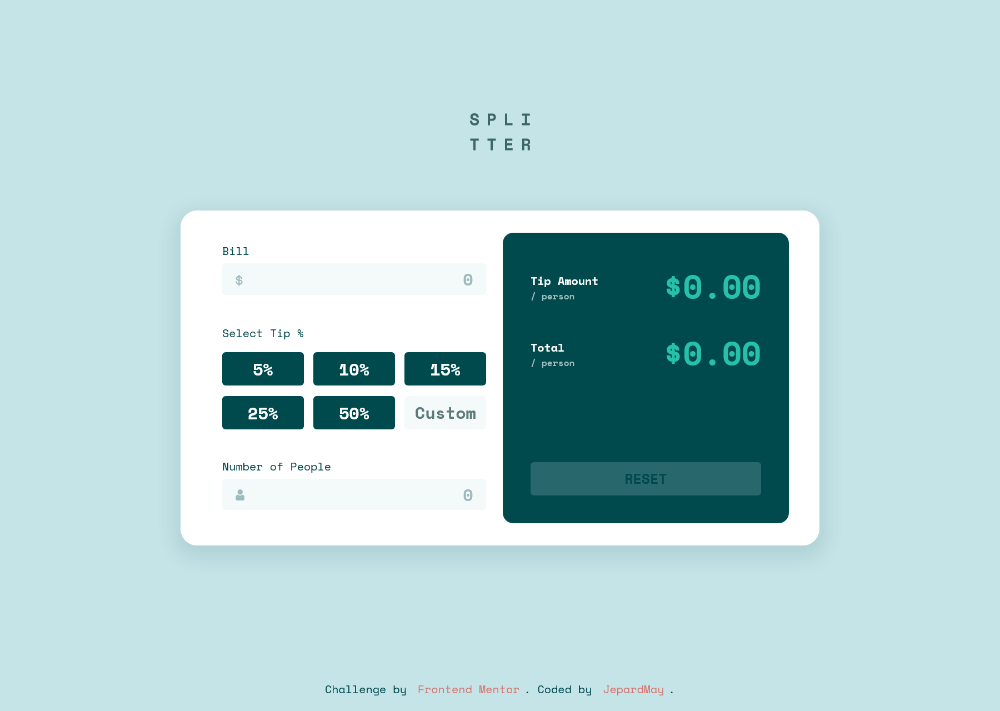
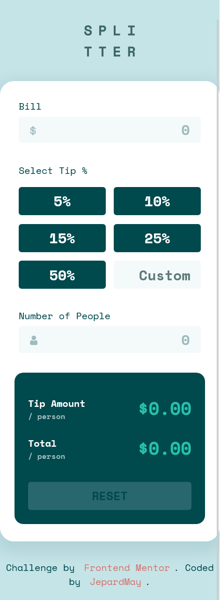

# Frontend Mentor - Tip calculator app solution

This is a solution to the [Tip calculator app challenge on Frontend Mentor](https://www.frontendmentor.io/challenges/tip-calculator-app-ugJNGbJUX). Frontend Mentor challenges help you improve your coding skills by building realistic projects.

## Table of contents

- [Overview](#overview)
  - [The challenge](#the-challenge)
  - [Screenshots](#screenshots)
  - [Links](#links)
- [My process](#my-process)
  - [Built with](#built-with)
  - [What I learned](#what-i-learned)
  - [Available Scripts](#available-scripts)
- [Author](#author)
- [Acknowledgments](#acknowledgments)

## Overview

### The challenge

Users should be able to:

- View the optimal layout for the app depending on their device's screen size
- See hover states for all interactive elements on the page
- Calculate the correct tip and total cost of the bill per person

### Screenshots

 

### Links

- Solution URL: [Frontend Mentor](https://your-solution-url.com)
- Live Site URL: [Netlify](https://heuristic-lichterman-e684b3.netlify.app/)

## My process

### Built with

- Semantic HTML5 markup
- CSS custom properties
- Flexbox
- SASS preprocessor
- Mobile-first workflow
- [React](https://reactjs.org/) - JS library

### What I learned

- How to use useContext
- How to use useReducer
- Why use PropTypes

### Available Scripts

In the project directory, you can run:

- #### `npm start`
- #### `npm test`
- #### `npm run build`

## Author

- GitHub - [Veronika Palto](https://github.com/JepardMay)
- Frontend Mentor - [@JepardMay](https://www.frontendmentor.io/profile/JepardMay)
